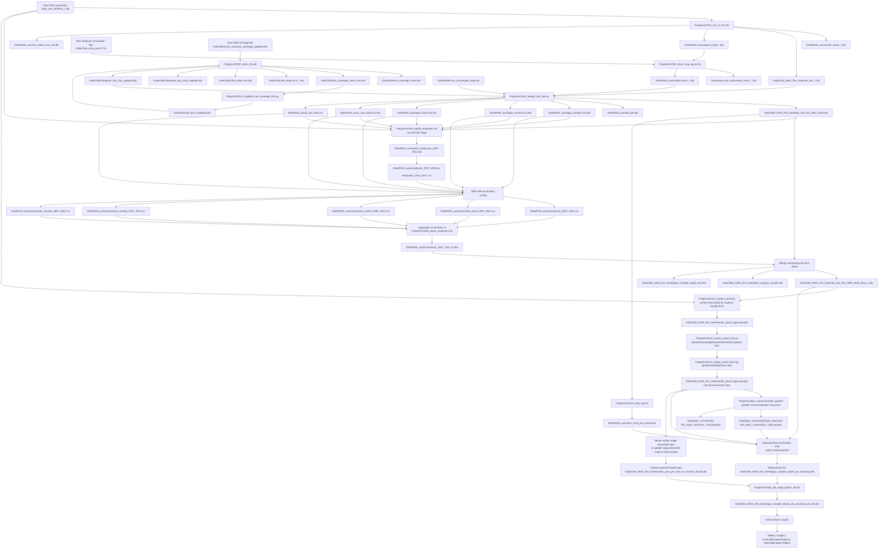
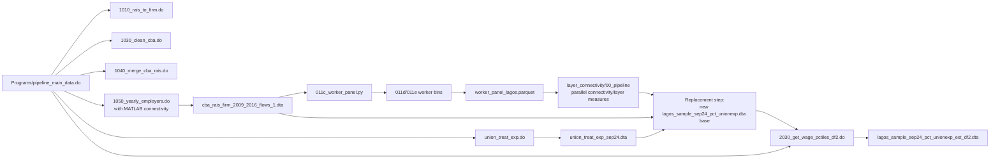

# Dataset Construction Flowchart

This maps the proposed option 1 construction path from raw RAIS/CBA files to the
analysis-ready files used by the draft. The legacy connectivity stage is
attached to `Programs/pipeline_main_data.do`, and the worker-level panel from
analysis-sample firms is now shown as an explicit upstream stage for the newer
parallel connectivity/layer pipeline.

## Main Flow

## Option 1 Runner Skeleton

## Known Gaps Before This Is Fully Replicable

1. `lagos_sample_sep24_pct_unionexp.dta` is the legacy missing upstream link.
   The intended option 1 path should replace this with the new parallel
   connectivity construction, but the exact script that writes the replacement
   firm-level file is still not identified in this map. The observed replacement
   output is `Data/CBA_RAIS_firm_level_currentconn_overlay/lagos_sample_sep24_pct_unionexp_ext_df2.dta`.

2. `Programs/1040_merge_cba_rais.do` appears to have a legacy typo in the
   zero-CBA treatment block: it saves `zero_cba_treat` to
   `Data/RAIS_aux/1_cba_treat.dta` before exporting `0_cba_treat.csv`.

3. The connectivity stage currently depends on MATLAB scripts run from
   `Programs/1050_yearly_employers.do`. Any canonical option 1 runner must call
   this stage or a verified replacement that reproduces:
   `totaltreat_pw_n`, `totaltreat_pf_n`, and `avg_ftreat_pf_n`.

4. Analysis scripts generally do not reconstruct connectivity. They use
   `totaltreat_pw_n` from the analysis-ready panel and create
   `totaltreat_pw_norm` by scaling it to the 2009 p90 among untreated
   spillover-sample firms.

5. The worker-level panel from analysis-sample firms should be part of option 1.
   The cleaner path is `Programs/011c_worker_panel.py` from raw RAIS plus
   `cba_rais_firm_2009_2016_flows_1.dta`, followed by
   `Programs/011d_worker_panel_bins.py` and
   `Programs/011e_worker_panel_bins2.py`. Older alternatives exist
   (`Programs/1060_rais_worker_panel.do`, `_run_012_worker_panel.do`,
   `2010_merge_lagos_worker.do`, `merge_lagos_worker_all.do`,
   `Programs/Python/create_lagos_workers.py`), but they produce broad
   worker-establishment panels or Lagos-worker merges rather than the cleaner
   analysis-sample worker panel.
